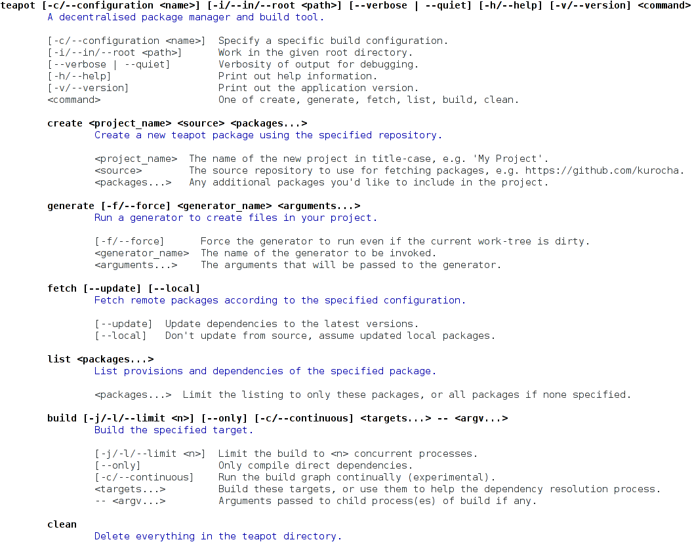

# Samovar



Samovar is a modern framework for building command-line tools and applications. It provides a declarative class-based DSL for building command-line parsers that include automatic documentation generation. It helps you keep your functionality clean and isolated where possible.

[](http://travis-ci.org/ioquatix/samovar)
[](https://codeclimate.com/github/ioquatix/samovar)
[](https://coveralls.io/r/ioquatix/samovar)

## Motivation

I've been using [Trollop](https://github.com/ManageIQ/trollop) and while it's not bad, it's hard to use for sub-commands in a way that generates nice documentation. It also has pretty limited support for complex command lines (e.g. nested commands, splits, matching tokens, etc). Samovar is a high level bridge between the command line and your code: it generates decent documentation, maps nicely between the command line syntax and your functions, and supports sub-commands using classes which are easy to compose.

One of the other issues I had with existing frameworks is testability. Most frameworks expect to have some pretty heavy logic directly in the binary executable, or at least don't structure your code in a way which makes testing easy. Samovar structures your command processing logic into classes which can be easily tested in isolation, which means that you can mock up and [spec your command-line executables easily](https://github.com/ioquatix/teapot/blob/master/spec/teapot/command_spec.rb).

## Examples

- [Teapot](https://github.com/ioquatix/teapot/blob/master/lib/teapot/command.rb) is a build system and uses multiple top-level commands.
- [Utopia](https://github.com/ioquatix/utopia/blob/master/lib/utopia/command.rb) is a web application platform and uses nested commands.
- [Synco](https://github.com/ioquatix/synco/blob/master/lib/synco/command.rb) is a backup tool and sends commands across the network and has lots of options with default values.

## Installation

Add this line to your application's Gemfile:

	gem 'samovar'

And then execute:

	$ bundle

Or install it yourself as:

	$ gem install samovar

## Usage

Generally speaking, you should create `Command` classes that represent specific functions in your program. The top level command might look something like this:

```ruby
require 'samovar'

class List < Samovar::Command
	self.description = "List the current directory"
	
	def call
		system("ls -lah")
	end
end

class Application < Samovar::Command
	options do
		option '--help', "Do you need help?"
	end
	
	nested :command, {
		'list' => List
	}, default: 'list'
	
	def call
		if @options[:help]
			self.print_usage
		else
			@command.call
		end
	end
end

Application.call # Defaults to ARGV.
```

### Basic Options

```ruby
require 'samovar'

class Application < Samovar::Command
	options do
		option '-f/--frobulate <text>', "Frobulate the text"
		option '-x | -y', "Specify either x or y axis.", key: :axis
		option '-F/--yeah/--flag', "A boolean flag with several forms."
		option '--things <a,b,c>', "A list of things" do |value|
			value.split(/\s*,\s*/)
		end
	end
end

application = Application.new(['-f', 'Algebraic!'])
application.options[:frobulate] # 'Algebraic!'

application = Application.new(['-x', '-y'])
application.options[:axis] # :y

application = Application.new(['-F'])
application.options[:flag] # true

application = Application.new(['--things', 'x,y,z'])
application.options[:things] # ['x', 'y', 'z']
```

### Nested Commands

```ruby
require 'samovar'

class Create < Samovar::Command
	def invoke(parent)
		puts "Creating"
	end
end

class Application < Samovar::Command
	nested '<command>',
		'create' => Create
	
	def invoke(program_name: File.basename($0))
		if @command
			@command.invoke
		else
			print_usage(program_name)
		end
	end
end

Application.new(['create']).invoke
```

### ARGV Splits

```ruby
require 'samovar'

class Application < Samovar::Command
	many :packages
	split :argv
end

application = Application.new(['foo', 'bar', 'baz', '--', 'apples', 'oranges', 'feijoas'])
application.packages # ['foo', 'bar', 'baz']
application.argv # ['apples', 'oranges', 'feijoas']
```

### Parsing Tokens

```ruby
require 'samovar'

class Application < Samovar::Command
	self.description = "Mix together your favorite things."
	
	one :fruit, "Name one fruit"
	many :cakes, "Any cakes you like"
end

application = Application.new(['apple', 'chocolate cake', 'fruit cake'])
application.fruit # 'apple'
application.cakes # ['chocolate cake', 'fruit cake']
```

### Explicit Commands

Given a custom `Samovar::Command` subclass, you can instantiate it with options:

```ruby
application = Application['--root', path]
```

You can also duplicate an existing command instance with additions/changes:

```ruby
concurrent_application = application['--threads', 12]
```

These forms can be useful when invoking one command from another, or in unit tests.

## Contributing

1. Fork it
2. Create your feature branch (`git checkout -b my-new-feature`)
3. Commit your changes (`git commit -am 'Add some feature'`)
4. Push to the branch (`git push origin my-new-feature`)
5. Create new Pull Request

### Future Work

#### Multi-value Options

Right now, options can take a single argument, e.g. `--count <int>`. Ideally, we support a specific sub-parser defined by the option, e.g. `--count <int...>` or `--tag <section> <tags...>`. These would map to specific parsers using `Samovar::One` and `Samovar::Many` internally.

#### Global Options

Options can only be parsed at the place they are explicitly mentioned, e.g. a command with sub-commands won't parse an option added to the end of the command:

```ruby
command list --help
```

One might reasonably expect this to parse but it isn't so easy to generalize this:

```ruby
command list -- --help
```

In this case, do we show help? Some effort is required to disambiguate this. Initially, it makes sense to keep things as simple as possible. But, it might make sense for some options to be declared in a global scope, which are extracted before parsing begins. I'm not sure if this is really a good idea. It might just be better to give good error output in this case (you specified an option but it was in the wrong place).

#### Shell Auto-completion

Because of the structure of the Samovar command parser, it should be possible to generate a list of all possible tokens at each point. Therefore, semantically correct tab completion should be possible.

As a secondary to this, it would be nice if `Samovar::One` and `Samovar::Many` could take a list of potential tokens so that auto-completion could give meaningful suggestions, and possibly improved validation.

#### Short/Long Help

It might be interesting to explore whether it's possible to have `-h` and `--help` do different things. This could include command specific help output, more detailed help output (similar to a man page), and other useful help related tasks.

## License

Released under the MIT license.

Copyright, 2016, by [Samuel G. D. Williams](http://www.codeotaku.com/samuel-williams).

Permission is hereby granted, free of charge, to any person obtaining a copy
of this software and associated documentation files (the "Software"), to deal
in the Software without restriction, including without limitation the rights
to use, copy, modify, merge, publish, distribute, sublicense, and/or sell
copies of the Software, and to permit persons to whom the Software is
furnished to do so, subject to the following conditions:

The above copyright notice and this permission notice shall be included in
all copies or substantial portions of the Software.

THE SOFTWARE IS PROVIDED "AS IS", WITHOUT WARRANTY OF ANY KIND, EXPRESS OR
IMPLIED, INCLUDING BUT NOT LIMITED TO THE WARRANTIES OF MERCHANTABILITY,
FITNESS FOR A PARTICULAR PURPOSE AND NONINFRINGEMENT. IN NO EVENT SHALL THE
AUTHORS OR COPYRIGHT HOLDERS BE LIABLE FOR ANY CLAIM, DAMAGES OR OTHER
LIABILITY, WHETHER IN AN ACTION OF CONTRACT, TORT OR OTHERWISE, ARISING FROM,
OUT OF OR IN CONNECTION WITH THE SOFTWARE OR THE USE OR OTHER DEALINGS IN
THE SOFTWARE.
