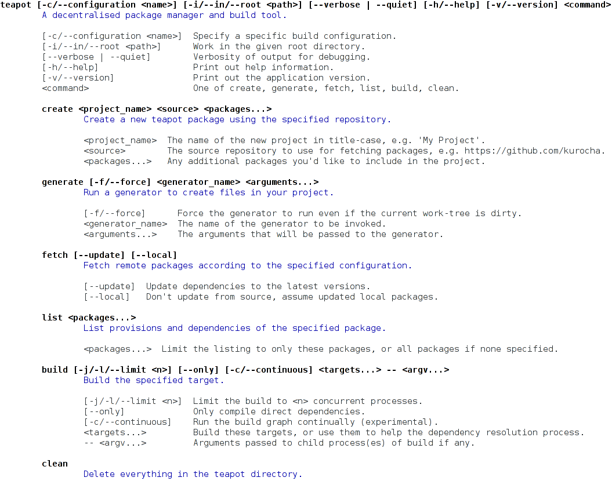

# Samovar



Samovar is a modern framework for building command-line tools and applications. It provides a declarative class-based DSL for building command-line parsers that include automatic documentation generation. It helps you keep your functionality clean and isolated where possible.

[](https://github.com/ioquatix/samovar/actions?workflow=Test)

## Motivation

I've been using [Optimist](https://github.com/ManageIQ/optimist) and while it's not bad, it's hard to use for sub-commands in a way that generates nice documentation. It also has pretty limited support for complex command lines (e.g. nested commands, splits, matching tokens, etc). Samovar is a high level bridge between the command line and your code: it generates decent documentation, maps nicely between the command line syntax and your functions, and supports sub-commands using classes which are easy to compose.

One of the other issues I had with existing frameworks is testability. Most frameworks expect to have some pretty heavy logic directly in the binary executable, or at least don't structure your code in a way which makes testing easy. Samovar structures your command processing logic into classes which can be easily tested in isolation, which means that you can mock up and [spec your command-line executables easily](https://github.com/ioquatix/teapot/blob/master/spec/teapot/command_spec.rb).

## Usage

Please see the [project documentation](https://ioquatix.github.io/samovar/) for more details.

  - [Getting Started](https://ioquatix.github.io/samovar/guides/getting-started/index) - This guide explains how to use `samovar` to build command-line tools and applications.

### Shell Auto-completion

Samovar can complete command lines using the same command grammar used for parsing. Static completions are generated automatically for options, option aliases, boolean negation flags, and nested command names.

You can provide value completions for options and positional arguments using `completions:`:

``` ruby
class Command < Samovar::Command
	def self.path_completions(context)
		Dir.glob("#{context.current}*")
	end
	
	options do
		option "--format <name>", "Output format.", completions: ["json", "text", "yaml"]
	end
	
	one :path, "Path to process.", completions: method(:path_completions)
end
```

Completion mode is enabled by setting `SAMOVAR_COMPLETE` to the zero-based cursor index in the application arguments:

``` shell
SAMOVAR_COMPLETE=1 command --for
```

Applications can also generate shell adapter scripts:

``` shell
samovar completions bash command
samovar completions zsh command
samovar completions fish command
```

## Releases

Please see the [project releases](https://ioquatix.github.io/samovar/releases/index) for all releases.

### v2.4.1

### v2.4.0

  - Fix option parsing and validation: required options are now detected correctly and raise `Samovar::MissingValueError` when missing.
  - Fix flag value parsing: flags that expect a value no longer consume a following flag as their value (e.g. `--config <path>` will not consume `--verbose`).
  - Usage improvements: required options are marked as `(required)` in usage output.

### v2.3.0

  - Add support for `--[no]-thing` explicit boolean flags, allowing users to explicitly enable or disable boolean options.

### v2.2.0

  - Add support for explicit output: commands can now specify an output stream (e.g. `STDOUT`, `STDERR`, or custom IO objects) via the `output:` parameter in `Command.call`.

### v2.1.4

  - `Command#to_s` now returns the class name by default, improving debugging and introspection.

## See Also

  - [Teapot](https://github.com/ioquatix/teapot/blob/master/lib/teapot/command.rb) is a build system and uses multiple top-level commands.
  - [Synco](https://github.com/ioquatix/synco/blob/master/lib/synco/command.rb) is a backup tool and sends commands across the network and has lots of options with default values.
  - [Bake](https://github.com/ioquatix/bake) is an alternative task runner that makes it easy to expose Ruby methods as command-line tasks.

## Contributing

We welcome contributions to this project.

1.  Fork it.
2.  Create your feature branch (`git checkout -b my-new-feature`).
3.  Commit your changes (`git commit -am 'Add some feature'`).
4.  Push to the branch (`git push origin my-new-feature`).
5.  Create new Pull Request.

### Running Tests

To run the test suite:

``` shell
bundle exec sus
```

### Making Releases

To make a new release:

``` shell
bundle exec bake gem:release:patch # or minor or major
```

### Developer Certificate of Origin

In order to protect users of this project, we require all contributors to comply with the [Developer Certificate of Origin](https://developercertificate.org/). This ensures that all contributions are properly licensed and attributed.

### Community Guidelines

This project is best served by a collaborative and respectful environment. Treat each other professionally, respect differing viewpoints, and engage constructively. Harassment, discrimination, or harmful behavior is not tolerated. Communicate clearly, listen actively, and support one another. If any issues arise, please inform the project maintainers.

## Future Work

### Multi-value Options

Right now, options can take a single argument, e.g. `--count <int>`. Ideally, we support a specific sub-parser defined by the option, e.g. `--count <int...>` or `--tag <section> <tags...>`. These would map to specific parsers using `Samovar::One` and `Samovar::Many` internally.

### Global Options

Options can only be parsed at the place they are explicitly mentioned, e.g. a command with sub-commands won't parse an option added to the end of the command:

``` ruby
command list --help
```

One might reasonably expect this to parse but it isn't so easy to generalize this:

``` ruby
command list -- --help
```

In this case, do we show help? Some effort is required to disambiguate this. Initially, it makes sense to keep things as simple as possible. But, it might make sense for some options to be declared in a global scope, which are extracted before parsing begins. I'm not sure if this is really a good idea. It might just be better to give good error output in this case (you specified an option but it was in the wrong place).

### Short/Long Help

It might be interesting to explore whether it's possible to have `-h` and `--help` do different things. This could include command specific help output, more detailed help output (similar to a man page), and other useful help related tasks.
